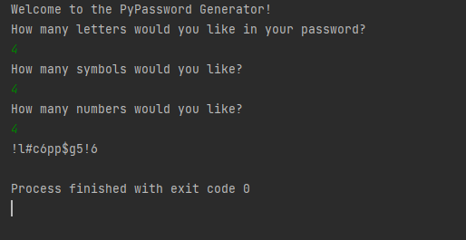

# Random Password Generator

## This Program Generates a Randomised password according to the requirements presented by the user.

## By doing this project I learned:

1. How to Use Lists.
2. Use of Conditional Statements inside the for Loop.
3. Appending to a String.